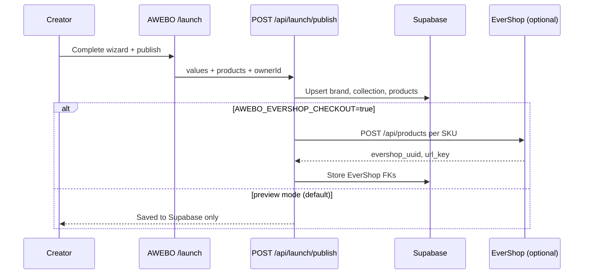
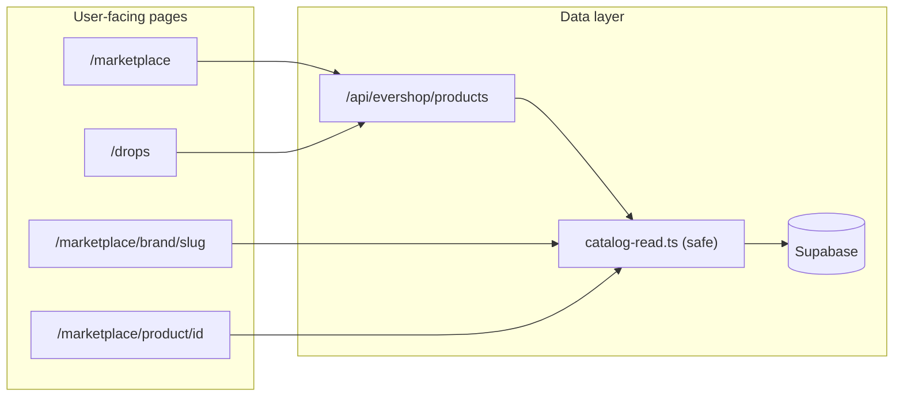

# AWEBO Platform Architecture

This document describes how creator brands, collections, products, and commerce fit together in the AWEBO codebase today.

## Current phase: preview commerce

EverShop is **not required** for the app to run. By default:

- Product links stay on **AWEBO storefront pages** (`/marketplace/product/...`)
- Checkout shows **preview UI** (no real orders)
- Publish saves brand metadata to **Supabase** without creating EverShop SKUs

Enable real commerce later with `AWEBO_EVERSHOP_CHECKOUT=true` plus a deployed EverShop instance. See [EVERSHOP_INTEGRATION.md](./EVERSHOP_INTEGRATION.md).

---

## Domain model

```
Creator (Privy login)
  └── Brand (Launch Brand wizard → publish)
        └── Collection (Genesis collection today; more later)
              ├── Token (on-chain — mock charts in marketplace for now)
              └── Products (physical SKUs — preview pages today, EverShop later)
```

| Entity | Stored in | Purpose |
|--------|-----------|---------|
| Creator | `creators` (Supabase) | Privy `owner_id` |
| Launch draft | `launch_drafts` (Supabase) | Wizard autosave |
| Brand | `brands` (Supabase) | Name, story, logo, banner, chain, launch mode |
| Collection | `brand_collections` | Collection name, token symbol |
| Product | `brand_products` | Name, price, SKU; optional EverShop FKs |
| Token performance | Mock in UI | One token per collection; charts are deterministic mocks |
| Orders / inventory | EverShop (future) | Not active until commerce flag is enabled |

---

## Page responsibilities

AWEBO splits **discovery**, **token performance**, and **physical products** across different surfaces:

| Route | Shows | Data source |
|-------|--------|---------------|
| `/launch` | Creator publish wizard | Supabase drafts + publish API |
| `/marketplace` | **Collection token cards** (ticker, PFP, banner, mock charts) | Supabase brands + mock explore feed |
| `/marketplace/brand/[slug]` | Brand profile, collections tab, product grid | Supabase (`resolveBrandPageView`) |
| `/marketplace/product/[id]` | Product detail (preview checkout) | Supabase (`resolveProductPageView`) |
| `/drops` | Physical product feed (EverShop-style cards) | `/api/evershop/products` |
| `/drops/my` | Creator's own brands and products | Supabase by `owner_id` |
| `/drops/product/[url_key]` | EverShop checkout (proxied) | **Only when EverShop is deployed** |
| `/drops/admin` | EverShop admin (proxied) | **Only when EverShop is deployed** |

### Important distinction

- **Marketplace** = collection-level **token performance** (one token per collection)
- **Drops** = **physical products** per brand/collection (buy merch)
- **Brand page** = brand hub linking both (products → product pages, collections → token cards)

---

## Request flow (publish)



---

## Request flow (browse)



Catalog reads use **safe wrappers** (`lib/awebo/catalog-read.ts`) so a Supabase misconfiguration returns empty data instead of a 500.

---

## Product URL conventions

| Pattern | Example | Used when |
|---------|---------|-----------|
| Composite id | `testbrand-testproduct` | Default AWEBO product page |
| Product id only | `testproduct` | Also resolves if unique in catalog |
| EverShop url_key | `testbrand-testproduct` | `/drops/product/...` only when checkout enabled |

Helper: `publishedProductHref()` in `lib/awebo/catalog-product-links.ts`

---

## Key modules

| Path | Role |
|------|------|
| `lib/awebo/catalog-registry.ts` | Read/write published brands (Supabase or local JSON) |
| `lib/awebo/catalog-read.ts` | Safe read wrappers (no page-crashing throws) |
| `lib/awebo/commerce-config.ts` | `AWEBO_EVERSHOP_CHECKOUT` feature flag |
| `lib/awebo/launch-publish.ts` | Publish orchestration |
| `lib/marketplace-brand-page.ts` | Brand page view model |
| `lib/marketplace-product-page.ts` | Product page view model |
| `lib/marketplace-collection-cards.ts` | Collection token cards + mock metrics |
| `lib/marketplace-data.ts` | Legacy demo brands/products (fallback) |

---

## Environment variables

### Required for production (Vercel)

```bash
NEXT_PUBLIC_SUPABASE_URL=
NEXT_PUBLIC_SUPABASE_PUBLISHABLE_KEY=
SUPABASE_SERVICE_ROLE_KEY=
NEXT_PUBLIC_PRIVY_APP_ID=
```

### Commerce (optional — off by default)

```bash
AWEBO_EVERSHOP_CHECKOUT=false   # keep false until EverShop is live
EVERSHOP_URL=
EVERSHOP_ADMIN_EMAIL=
EVERSHOP_ADMIN_PASSWORD=
```

---

## Storage backends

| Environment | Drafts + catalog |
|-------------|------------------|
| Local dev (no Supabase service key) | `data/*.json` files |
| Vercel / production | Supabase only (throws if service key missing on write) |

---

## Related docs

| Doc | Contents |
|-----|----------|
| [backend-migrations/README.md](./backend-migrations/README.md) | SQL schema, migration order |
| [EVERSHOP_INTEGRATION.md](./EVERSHOP_INTEGRATION.md) | EverShop deploy + admin guide |
| [backend-migrations/api-contracts.md](./backend-migrations/api-contracts.md) | HTTP API shapes |
| [USER_FLOW_DIAGRAMS.md](./USER_FLOW_DIAGRAMS.md) | UX flows |

---

## Roadmap (not implemented)

- [ ] On-chain token deploy after publish (smart contract step — mock today)
- [ ] Real token price feeds in marketplace modal
- [ ] Drops collection filter + product tags from catalog
- [ ] AWEBO-native checkout → EverShop order API
- [ ] Auto-create EverShop category per brand/collection
