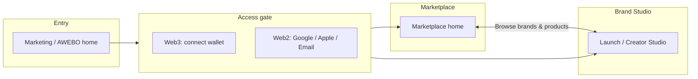
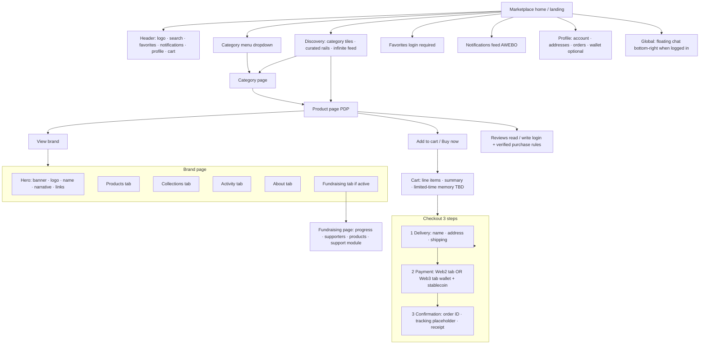
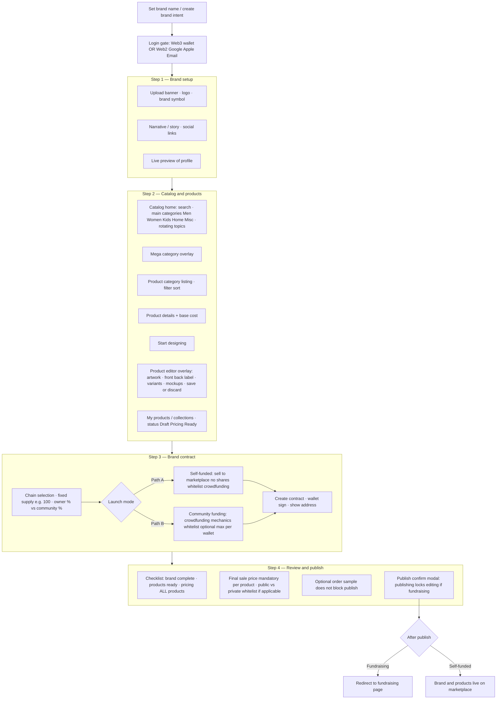
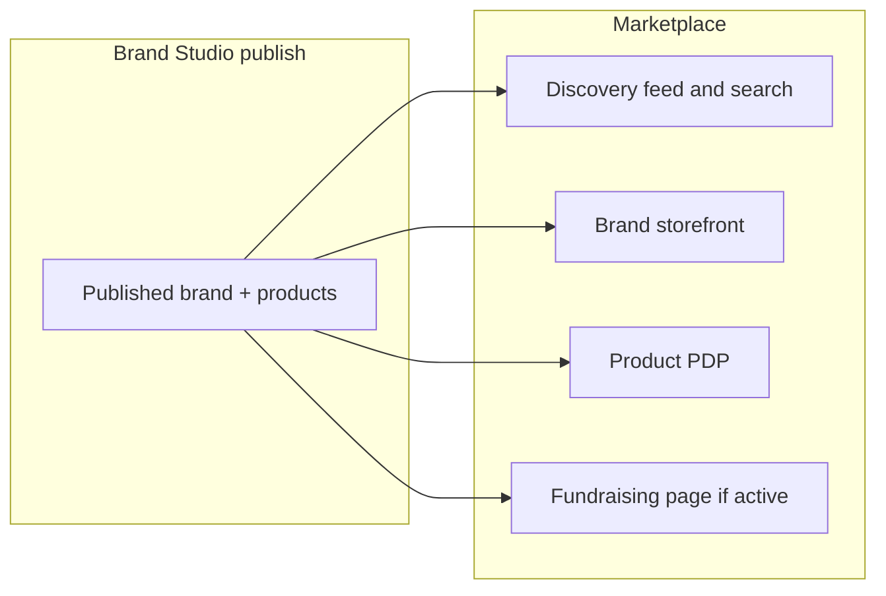

# User flow diagrams (from PDF specs)

This document visualizes the **Creator User Flow — Brand Studio** and **User Flow — Marketplace** PDFs using Mermaid. Render the diagrams in GitHub, VS Code (Markdown preview), or any Mermaid-compatible viewer.

---

## 1. High-level: who goes where

---

## 2. Marketplace shopper flow (PDF: User Flow — marketplace)

Top-of-funnel through purchase; matches header, discovery, PDP, cart, and account surfaces.

---

## 3. Brand Studio creator flow (PDF: Creator User Flow — Brand Studio)

Four-step stepper from access through publish; includes contract fork self-funded vs crowdfunding.

---

## 4. Overlay: Brand Studio output → Marketplace

How the creator journey connects to surfaces shoppers see.

---

## 5. Legend (PDF terminology)

| PDF concept | Meaning in diagrams |
|-------------|---------------------|
| Access gate | Wallet or email/social login before gated actions |
| Mega category | Full category tree overlay from menu |
| PDP | Product detail page: gallery, variants, shipping snippet, CTAs |
| Path A / Self-funded | Direct marketplace listing; simpler contract path in PDF |
| Path B / Crowdfunding | Raise with community; whitelist and per-wallet caps; post-publish fundraising UX |
| Cart memory TBD | Time-limited cart persistence; noted in PDF as to be defined |

---

*Source: Creator User Flow — Brand Studio PDF; User Flow — marketplace PDF. Diagrams are descriptive; implementation may simplify or stub individual nodes.*
